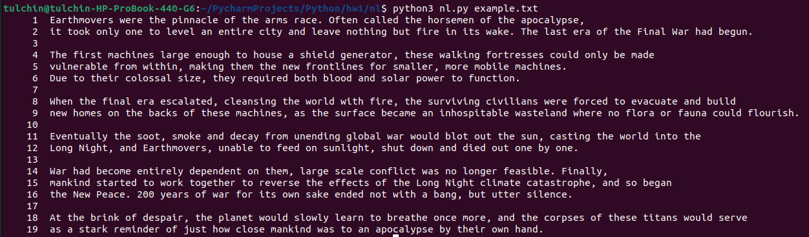
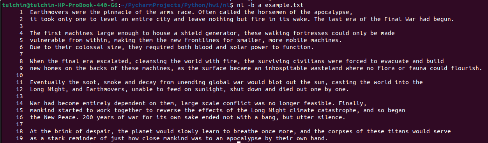
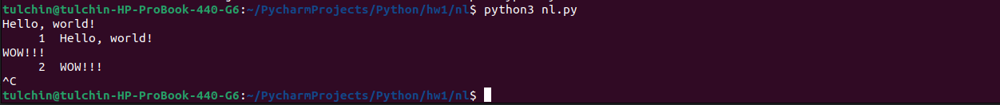
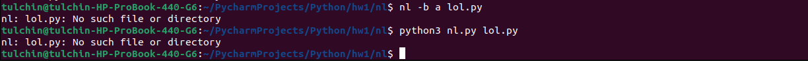

# nl

Для запуска скрипта нужно ввести команду с терминала:

```bash
python3 nl.py <file>
```

`file` -- опциональный путь до файла с текстом.
Если путь до файла не задан, скрипт будет работать на вводе 
пользователя через `stdin`.

## Работа с файлом

Пример можно запустить командой
```bash
python3 nl.py ./artifacts/example.txt
```

Вывод скрипта:


Для сравнения вывод утилиты *nl*:


## Работа с пользовательским вводом

```bash
python3 nl.py
```

Для окончания работы можно передать `KeyboardInterrupt` символ (`Ctrl-C`).

Пример работы:


## Нет файла

Если файла не существует, выводы утилиты и скрипта будут одинаковы:


