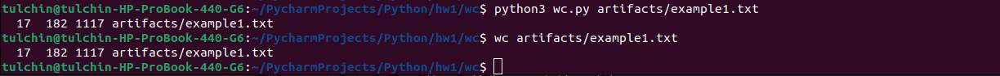
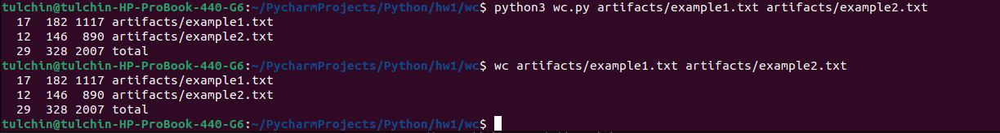

# tail

Для запуска скрипта нужно ввести команду с терминала:

```bash
python3 wc.py <files>
```

`files` -- опциональные пути до файлов с текстом.
Если пути до файла не заданы, скрипт будет работать на вводе 
пользователя через `stdin`.

## Работа с файлами

Пример с одиночным файлом можно запустить командой
```bash
python3 wc.py artifacts/example1.txt
```

Сравнение скрипта и утилиты:


Пример с несколькими файлами можно запустить командой
```bash
python3 wc.py artifacts/example1.txt artifacts/example2.txt
```

Сравнение скрипта и утилиты:


## Работа с пользовательским вводом

```bash
python3 wc.py
```

Для окончания работы нужно передать `EOF` символ (`Ctrl-D`).

Пример работы:


## Нет файла

Если файла не существует, выводы утилиты и скрипта будут одинаковы:


